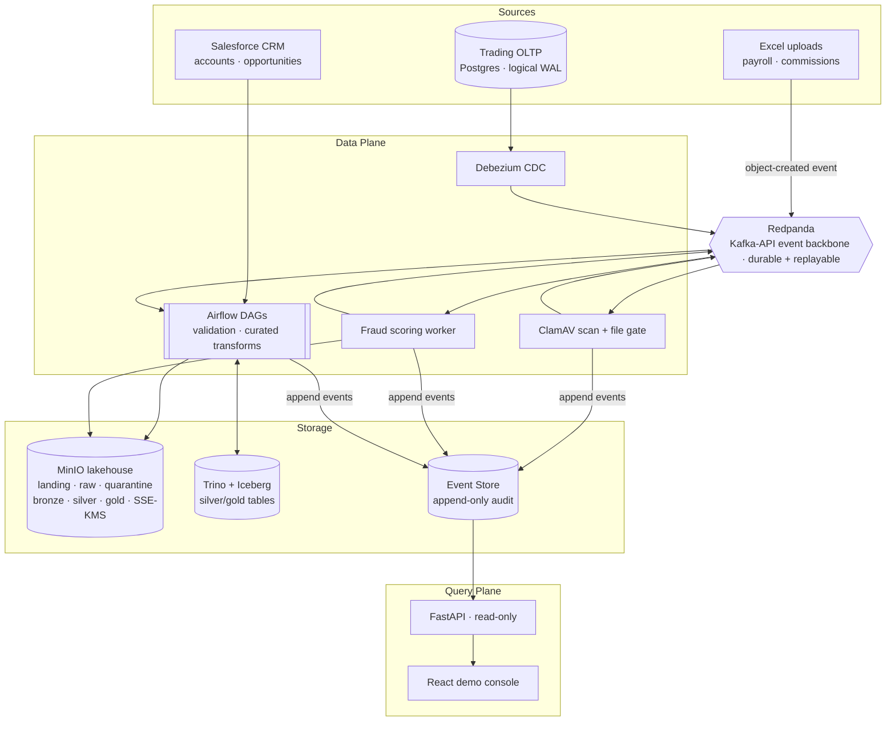

# Meridian Fintech Demo

**An event-driven, compliance-aligned data engineering platform — built to run entirely on a laptop, at zero cloud cost.**

It models a real problem a regulated financial firm faces — three messy, unrelated data sources that must be normalized, aggregated, and made *legally defensible* — and solves it with the architecture a senior data engineer would actually reach for: durable event streams, an immutable audit trail, a bronze/silver/gold lakehouse, infrastructure-as-code security, and a read-only console to observe and trace any run end to end.

It is **compliance-*aligned* by architecture and controls** (FINRA, SOC 2, GDPR) — not a claim of formal certification.

---

## Meet Meridian

The whole platform is built around a fictional client: **Meridian**, a mid-sized wealth-management firm. Meridian isn't decoration — every pipeline, table, and access rule exists because some part of the business needs it, and that framing is what keeps the engineering honest.

Meridian's data is generated by departments that don't talk to each other:

| Department | Produces | Lands as |
| --- | --- | --- |
| **Trading Desk** | A high-volume transaction database (an internal OLTP system) | Change-data-capture stream |
| **People Operations** | Payroll workbooks | Excel uploads |
| **Revenue Operations** | Advisor commission adjustments | Excel uploads |
| **Sales** | A CRM of client accounts and opportunities | Salesforce pulls |

And departments that *consume* it:

| Department | Needs |
| --- | --- |
| **Compliance** | A byte-by-byte audit trail, immutable history, lawful retention, and the ability to honor a customer's "right to be forgotten" |
| **Data Science & Analysts** | Cleaned, de-identified, normalized data |
| **BI & Leadership** | Aggregated KPIs with no raw PII |
| **Data Platform / SRE** | One control tower to watch every pipeline, trace any run, and recover from failure |

**The business problem:** take three disparate sources, move each through a tiered refinement process, and produce one normalized, trustworthy picture of the firm — while proving, for every single record, exactly where it came from and everything that happened to it. In a fintech context that auditability isn't a nice-to-have; it's the product.

---

## What this project demonstrates

Read as a portfolio piece, the platform is a tour of senior-level data-engineering decisions:

- **Event-driven, not API-driven.** Ingestion is triggered by events on a durable broker and runs even if the API is offline. Runs are *created by* trigger events (event-first), never pre-created by a CRUD call.
- **Legally defensible lineage.** Every cross-service transition is an event; an append-only event store records the full timeline, and the UI reconstructs any run's inputs → transformations → outputs.
- **Immutable + replayable.** History is never rewritten. Corrections append new events; reprocessing replays from broker offsets and stored checkpoints, with idempotency guards that prevent duplicates.
- **Security encoded as infrastructure.** Least-privilege identities per stage, SSE-KMS encryption on curated layers, internal-only networking, and append-only database roles — all defined in Terraform, Compose, and SQL rather than configured by hand.
- **A real medallion lakehouse.** Bronze (source-faithful) → Silver (SCD2, de-identified) → Gold (KPI aggregates) on Iceberg + Trino, driven by event-triggered Airflow DAGs.
- **GDPR erasure that respects financial retention.** The hard part — "delete this customer" vs. "keep these records for seven years" — solved with crypto-shredding and BI suppression rather than hand-waving (see [Compliance & Governance](#compliance--data-governance)).

---

## Architecture at a glance

Two planes that never block each other: a **data plane** that ingests and transforms, and a **query plane** that reads. They communicate only through the event store and object storage — stop the query plane and ETL keeps flowing; stop ingestion and the UI still serves history.



**The medallion spine** runs through MinIO object storage:

- **Bronze** — source-faithful, append-only, full fidelity (unmasked). Read-access restricted to platform & compliance. The forensic record.
- **Silver** — cleaned, deduplicated, SCD Type 2, PII tokenized. For analysts and data science.
- **Gold** — aggregated KPIs, no direct PII. For BI and leadership.

---

## The three source pipelines

Each pipeline is independent, event-triggered, and ends at "bronze-ready," where the curated layer takes over.

### 1. Excel ingestion — People Ops & Revenue Ops

A finance user drops a workbook into a landing bucket they alone can write to. That object-created event kicks off the chain:

1. **Scan** — a ClamAV worker enforces malware, MIME, and size gates.
2. **Validate** — an Airflow DAG checks the workbook against a schema contract.
3. **Branch** — valid files are promoted toward bronze; invalid files are copied to **quarantine** and an alert is raised (the run closes `quarantined`, preserved as audit history).
4. **Bronze** — a writer converts the data to Parquet with encryption headers and emits a bronze-ready event.

Two schema contracts ship today: `payroll_v1` and `commission_adjustment_v1`.

### 2. CDC + fraud — the Trading Desk

The trading database streams every change out via Debezium logical replication onto the event backbone. A **fraud-scoring worker** consumes that stream and applies a continuous risk model (calibrated so a transaction at an instrument's threshold scores exactly the firm's risk cutoff). High-risk transactions are flagged idempotently back in the source database, an alert is raised, and a **zero-transformation** bronze writer persists the assessed events with full Kafka/LSN metadata for forensic ordering. A synthetic load generator keeps trades flowing so scoring is always observable.

> The classic interview example — "flag any AAPL trade over $10k" — is preserved as the deterministic demo trigger, but the production-shaped path is a calibrated continuous score, not a hard-coded `if`.

### 3. Salesforce CRM — Sales

A scheduled Airflow DAG performs **incremental** pulls from a mock Salesforce service using a stored cursor, persists the raw API responses as artifacts for traceability, and emits bronze-ready events for CRM objects (Accounts, Opportunities). The cursor logic is identical to what a real org integration would use.

---

## The curated layer (silver → gold)

A bronze-ready event from *any* source triggers the curated chain, built as a **listener / transform DAG pair**: a continuous listener watches for upstream events and fans out parallel transform runs.

- **Silver** applies SCD Type 2 history, deduplication, and per-subject PII tokenization, merging into Iceberg tables via Trino: `dim_opportunity`, `dim_account`, `dim_loan`, `fact_loan_payment`, `loan_status_history`, `fact_commission_adjustment`.
- **Gold** aggregates KPI tables with no direct PII: `kpi_pipeline_conversion`, `kpi_portfolio_health`, `kpi_payment_performance`, `kpi_commission_economics`.

Every silver and gold run records a checkpoint and emits a completion event in a single transaction, so the curated layer is as auditable and replayable as ingestion. Iceberg gives the curated tables snapshot isolation and time travel for point-in-time queries.

---

## Compliance & data governance

This is where a fintech platform earns its keep.

- **Append-only audit.** The event store's write-path role has no `UPDATE` or `DELETE` privilege. History is immutable by database grant, not by convention.
- **Encryption as policy.** Bucket policies *deny* writes to `bronze/silver/gold/quarantine` unless server-side KMS headers are present; keys are managed by Vault Transit through a KES gateway.
- **Least privilege everywhere.** Ingress, transformation, and query each run under distinct identities scoped to exactly what they touch — finance can only write to landing, the query API can only read, the demo writer can only insert one transaction type.
- **Replay & recovery.** Documented Detect → Diagnose → Recover → Verify playbooks per pipeline; reprocessing replays broker offsets with idempotency guards so a replay never double-counts.

### The right to be forgotten, without breaking retention

A customer asks to be erased. Financial regulation requires Meridian to *retain* trade and account records for years. These pull in opposite directions — and the resolution is the platform's most interesting feature:

- **Bronze is retained, untouched**, under the legal-retention exemption (GDPR Art. 17(3)(b); FINRA/SEC books-and-records rules). This is *why* bronze is immutable.
- **Silver and gold are erased by crypto-shredding.** Each customer account is tokenized with its *own* per-subject key. Erasing a subject destroys that key, so its token can never be reproduced or linked back to the person — anonymization under GDPR Recital 26 — while the record skeleton survives for lineage.
- **BI suppression (Art. 18).** The subject's token is captured before the key is destroyed and recorded in a suppression registry, so gold KPIs exclude the erased subject going forward.
- **The erasure itself is audited** in an append-only log holding only keyed hashes — Compliance can prove *that* a subject was forgotten without ever re-exposing who they were.

You can trigger an erasure from the UI and watch the subject's token go unrecoverable while its bronze record stays intact.

---

## The query plane & demo console

The API is **read-only** and exists only to serve the UI — it never orchestrates ETL and pipeline metadata never flows through it. In demo mode the UI is anonymous (no login), relying on network and rate controls.

The React console (the SRE control tower) gives you:

- **Overview** — the project and Meridian's story.
- **Runs** — every pipeline execution with source, stage, status, and duration; filter by pipeline, sort server-side, drill into any run.
- **Run detail** — Events timeline, Lineage (inputs → outputs across tiers), Artifacts, Alerts, and a data Preview, all reconstructed from the event store.
- **Transactions** — recent trades with risk flags; high-risk rows link back to the run that scored them.
- **Alerts** — the system feedback feed (where notifications surface instead of Slack).
- **Metrics** — consumer-group lag and 30-day pipeline analytics.
- **Excel Upload / Backfill / Erasure** — generate demo data on demand, including intentional schema failures, high-risk trades, historical backfills, and GDPR erasures.

---

## Tech stack

| Component | Role |
| --- | --- |
| **Redpanda** | Kafka-API event backbone — durable topics, replay, fan-out |
| **Apache Airflow** | Event-triggered DAG orchestration (validation + curated transforms) |
| **MinIO** | S3-compatible lakehouse object storage |
| **Trino + Apache Iceberg** | Curated query engine + table format (SCD2, time travel) |
| **Debezium** | Change-data-capture from the trading OLTP database |
| **HashiCorp Vault + KES** | KMS for MinIO server-side encryption |
| **Keycloak** | OIDC identity for demo personas |
| **ClamAV** | Upload malware scanning |
| **PostgreSQL** | Event store (audit), trading OLTP source, and platform/catalog DB |
| **FastAPI** | Read-only query API |
| **React + Vite** | Demo console |
| **Terraform + Docker Compose** | Infrastructure as code: identities, ACLs, policies, topology |

---

## Quickstart

**Prerequisites:** Docker + Docker Compose, GNU Make. (Terraform runs inside a container — no host install needed.)

```bash
cp infra/.env.example infra/.env   # then fill in secrets/credentials
make infra-up                      # staged bring-up, steps 1–12
```

When it settles:

- **UI** → http://localhost:3000
- **API** → http://localhost:8000

Data-plane services (broker, databases, object storage, KMS) are intentionally **not** published to host ports. For browser access to the MinIO console during development:

```bash
make infra-up-dev                  # adds MinIO console :9000/:9001 and pgAdmin :5050
```

Useful operational targets:

```bash
make infra-ps                      # container status
make consumer-lag                  # live consumer-group lag
make replay-group GROUP=<name>     # rewind a consumer group to replay
make infra-clean                   # tear down + wipe local volumes/state
```

---

## Try it: a guided demo

With the stack running, drive each pipeline from the UI and watch it flow through **Runs**:

1. **Happy path (Excel)** — *Excel Upload* → generate a valid workbook. Watch the run go scan → validate → bronze → `completed`, then open it to see the lineage and data preview.
2. **Schema failure** — *Excel Upload* → generate an *invalid* workbook. It clears scanning but is quarantined; an alert appears and the run closes `quarantined`.
3. **Fraud detection** — *Transactions* → inject a high-risk trade. Within seconds it's flagged, a high-severity alert is raised, and the scoring run is linked from the transaction row.
4. **Right to be forgotten** — *Erasure* → erase a customer account. The subject's token becomes unrecoverable and it drops out of gold KPIs, while its bronze record remains for compliance.
5. **Replay** — rewind a consumer group (`make replay-group ...`) and confirm idempotency guards prevent any duplication.

---

## Testing

```bash
make test-unit    # fast unit suite (no infrastructure required)
make test-e2e     # end-to-end scenarios against the running stack
```

The end-to-end suite codifies four named scenarios — **success**, **schema-fail**, **fraud-fail**, and **replay** — and runs in-network against the live stack, exercising the real brokers, databases, and object storage rather than mocks.

---

## Repository layout

```
apps/ui/             React demo console (Vite + TypeScript)
services/
  workers/           Event-driven workers: scanner, trigger, bronze writers,
                     fraud scorer, load generator, read-only query API
  pipeline/          Airflow DAGs (Excel validation, Salesforce pull, curated transforms)
  libs/              Shared libraries: event contracts, event store, masking/crypto-shred
                     vault, object storage, broker producers, runtime helpers
infra/
  compose/           Docker Compose service topology (per pipeline)
  terraform/         IaC: bootstrap (storage/DB/policies) + identity (Keycloak/ACLs)
  db/                SQL migrations: event store, OLTP, lakehouse, privacy vault
  docker/            Service images
tests/               Unit suite + tests/integration end-to-end scenarios
Makefile             Staged bring-up, operations, and test targets
```

---

## Design decisions & honest scope

The project was originally sketched against AWS managed services; it was deliberately re-grounded on local, free, open-source equivalents that preserve the same contracts, so the cloud path is a substitution rather than a rewrite:

- **AWS EventBridge → MinIO notifications + Redpanda + Airflow** (a local "EventBridge equivalent").
- **S3 / DMS → MinIO / Debezium** (the S3 API and CDC envelope contracts are preserved).
- **Kubernetes fraud service → a single stateless worker container** (horizontally scalable; K8s is a deployment detail, not an architecture change).
- **Slack notifications → the UI alert feed** (feedback is visible to *any* observer, not just a private channel).
- **Free-tier Salesforce → a mock service** (the incremental-pull contract is identical).

Because the platform programs against portable contracts — S3 API, Kafka API, SQL, Iceberg, OIDC — every component maps cleanly onto AWS (MinIO→S3, Redpanda→MSK, Debezium→DMS, Airflow→MWAA, Vault/KES→KMS, Keycloak→Cognito) without rewriting application code.

**Honest scope:** it is compliance-*aligned* by architecture and controls, not formally certified; the UI is intentionally anonymous in demo mode; Salesforce and select services are mocked to stay local-first and free.

---

## Built with an AI-assisted development workflow

This platform was built collaboratively with an AI coding agent under a disciplined, repeatable engineering process — and that process is part of what the project demonstrates.

- **Structured context bootstrap.** Every working session loads project context in a fixed order before any code is written, so the agent operates from current architecture and standards rather than guesswork.
- **Intent vs. execution, kept separate.** Product intent (what we're building and why) is maintained as a source-of-truth distinct from execution state (what's actually done). The two never blur, so "the plan" can't silently drift into "the status."
- **A per-task development loop.** Every change follows the same cycle: load context → reconcile with the plan → make the *minimal* change → verify with targeted tests → reconcile technical-debt tracking → update execution status → report deltas and risks.
- **Phased, verified delivery.** The system was delivered in nine incremental phases — foundation, encryption, the three pipelines, the curated layer, the query plane/UI, observability hardening, and portfolio hardening — each verified before the next began.
- **Tech-debt discipline.** Every deliberate shortcut is tracked with both an in-code marker and a ledger entry, and both are removed together when the debt is paid — so deferred work is never silently lost.

The result is a codebase where decisions are traceable, scope is controlled, and the "why" behind each piece is recoverable — the same accountability the platform provides for Meridian's data, applied to its own construction.
